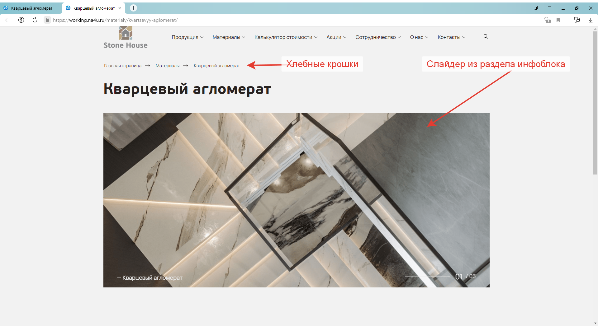
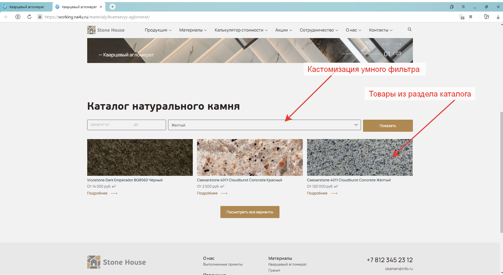
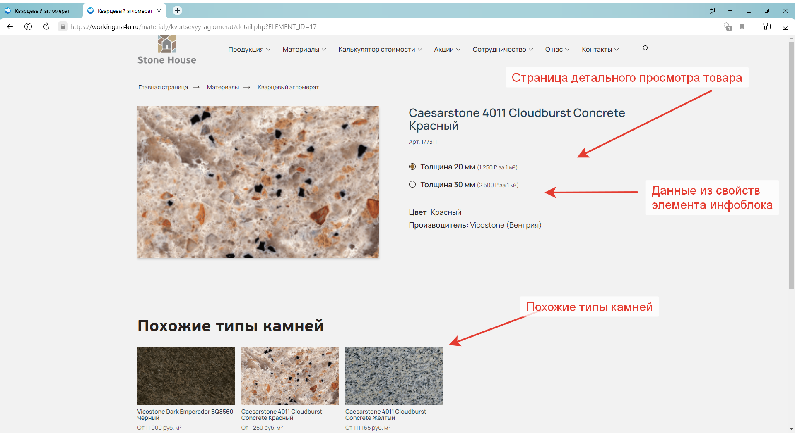
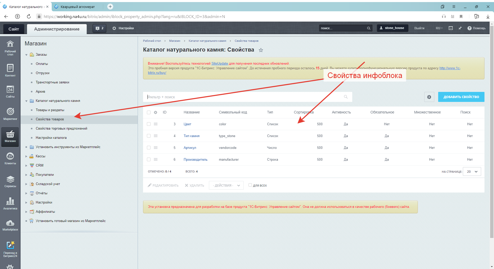
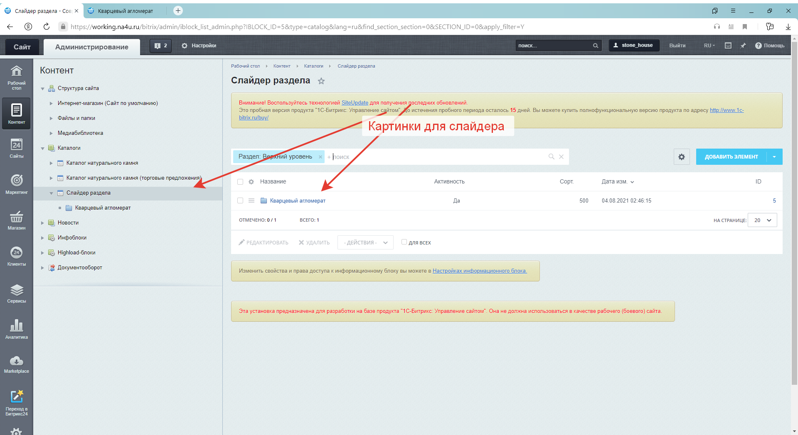
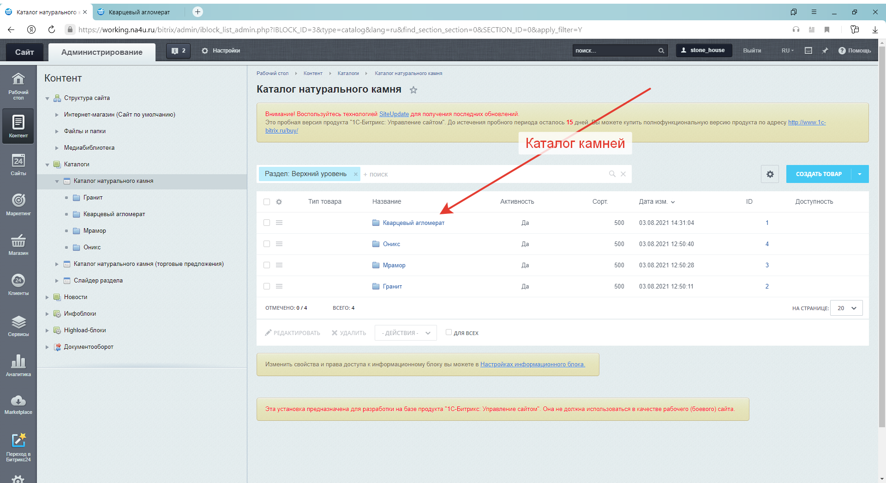
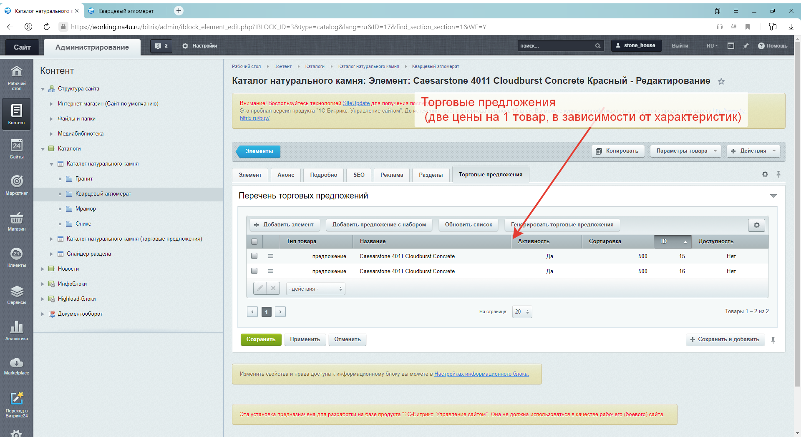

# Integration-of-layout-into-Bitrix
Интеграция готовой вёрстки в CMS Битрикс

Интеграция готовой вёрстки каталога и страницы детального просмотра в CMS Битрикс.  
Привязка к инфоблокам в административной части сайта.  
Кастомизация умного фильтра.  

Установка:    
Поместить содержимое папки www в корневой каталог сайта 

Скриншоты 

    
 
 
 
 
 
